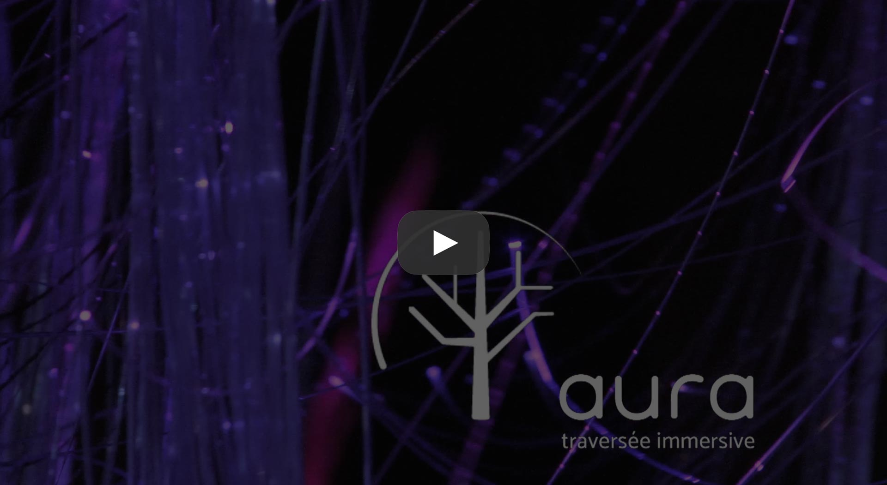

#  Aura - Traversée immersive

[](https://www.youtube.com/watch?v=CvLYBNCQGkw)

[:us: English version here](README.md)

[](http://www.derivative.ca/Builds/TouchDesigner088.58910.64-Bit.exe) 
[](https://cycling74.com/max7/) 
[](http://www.dataton.com/watchout) 

### Cloner le projet
```
git clone git@github.com:MIUQAM/aura.git
```

### Télécharger les ressources
- Visuel :
  - Télécharger l'archive suivante : http://projetaura.com/media/touchdesigner-media.zip ([Mirror](https://drive.google.com/open?id=0B3Nb5jB8NyWPSDRBTkM1UXRfczQ))
  - Extraire le contenu de l'archive dans le dossier `touchdesigner/media/`
- Audio :
  - Télécharger l'archive suivante : http://projetaura.com/media/max-media.zip ([Mirror](https://drive.google.com/open?id=0B3Nb5jB8NyWPbDQ3VFQ5RnhhSlk))
  - Extraire le contenu de l'archive dans le dossier `max/media/`

### Schéma de communication visuel
[](https://www.lucidchart.com/documents/view/46d38f88-bbe4-4ac7-bbc7-b418d1179246)
(cliquer pour viewer Lucidchart)

### Schéma des connexions
[](https://www.lucidchart.com/documents/view/9890331f-64d0-4a9a-a718-01d56c739518)
(cliquer pour viewer Lucidchart)

### Équipe de développement 
#### Audio
- Joël Côté Bergevin
- Louis-Simon Carli
- Marc-André Cossette ([Website](http://www.creationsmac.com), [LinkedIn](https://linkedin.com/in/macossette))

#### Électro / Arduinos
- Jonathan Jeason ([Github](https://github.com/jjshred), [LinkedIn](https://linkedin.com/in/giovanni-jeanson-7a8974ba))
- Hugo Laliberté ([Website](http://hugolaliberte.com/), [Github](https://github.com/lachose1), [LinkedIn](https://ca.linkedin.com/in/hugolaliberte))

#### Intégration
- Marc-Antoine Brodeur ([Website](http://marcantoinebrodeur.com), [Github](https://github.com/mabrodeur), [LinkedIn](https://www.linkedin.com/in/marcantoinebrodeur/))
- Erwan d'Orgeville ([Website](http://erwandorgeville.com), [Github](https://github.com/th3m4ri0), [LinkedIn](https://linkedin.com/in/th3m4ri0))

#### Visuel
- Maxime Bergeron ([Github](https://github.com/maxime1bergeron), [LinkedIn](https://linkedin.com/in/maxime1bergeron))
- Hugo Daoust ([LinkedIn](https://www.linkedin.com/in/hugo-daoust-4174b610a))
- Ruby-Maude Rioux ([Github](https://github.com/rubanmauve), [LinkedIn](https://linkedin.com/pub/ruby-maude-rioux/5a/3b9/b5a))

Toute l'équipe du projet (n'ayant pas tous participé à la programmation) est sur [notre site web](http://projetaura.com) !

### License
Copyright 2016  
Code libéré sous [license MIT](LICENSE): http://opensource.org/licenses/MIT