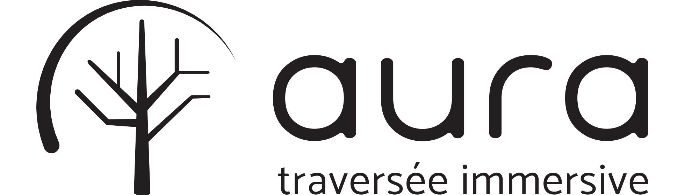
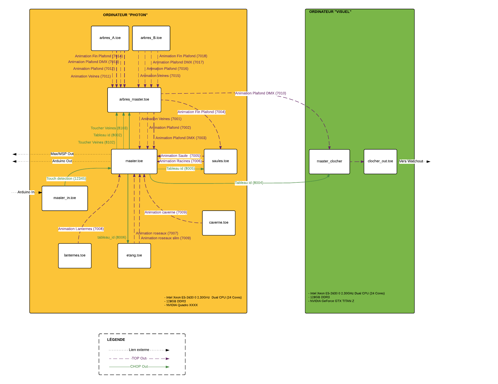
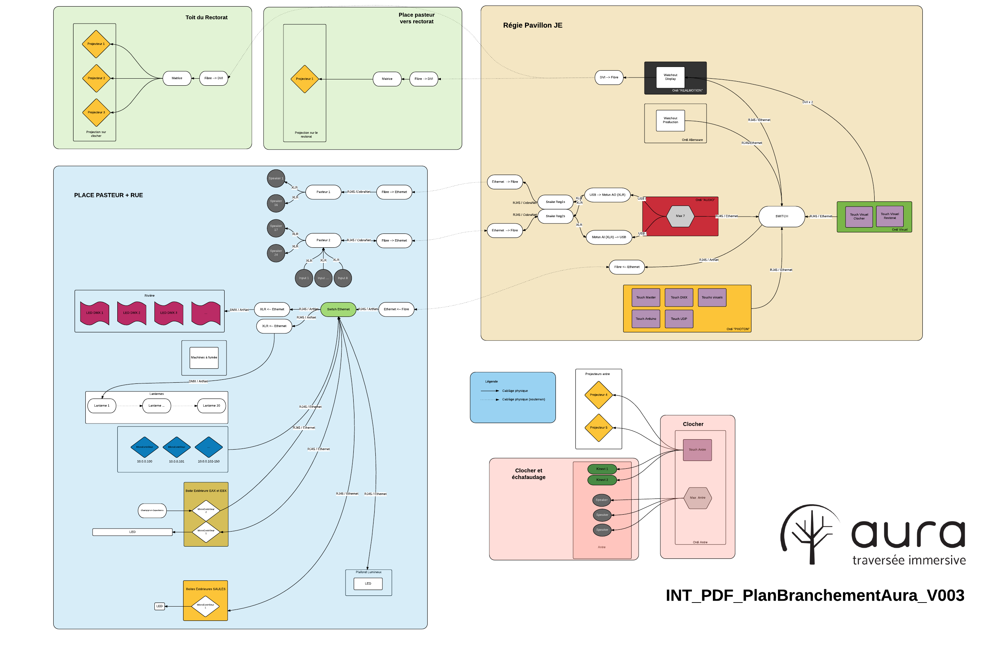

# 

[:us: English version here](README.md)

N.B. : La version de _TouchDesigner_ utilisée pour ce projet est la [version 58910.](http://www.derivative.ca/Builds/TouchDesigner088.58910.64-Bit.exe)

### Cloner le projet
```
git clone git@github.com:MIUQAM/aura.git
```

### Télécharger les ressources
- Visuel :
  - Télécharger l'archive suivante : http://projetaura.com/media/touchdesigner-media.zip ([Mirror](https://drive.google.com/open?id=0B3Nb5jB8NyWPSDRBTkM1UXRfczQ))
  - Extraire le contenu de l'archive dans le dossier `touchdesigner/media/`
- Audio :
  - Télécharger l'archive suivante : http://projetaura.com/media/max-media.zip ([Mirror](https://drive.google.com/open?id=0B3Nb5jB8NyWPbDQ3VFQ5RnhhSlk))
  - Extraire le contenu de l'archive dans le dossier `max/media/`


### Schéma de communication visuel
[](https://www.lucidchart.com/documents/view/46d38f88-bbe4-4ac7-bbc7-b418d1179246)
(cliquer pour viewer Lucidchart)

### Schéma des connexions
[](https://www.lucidchart.com/documents/view/9890331f-64d0-4a9a-a718-01d56c739518)
(cliquer pour viewer Lucidchart)
