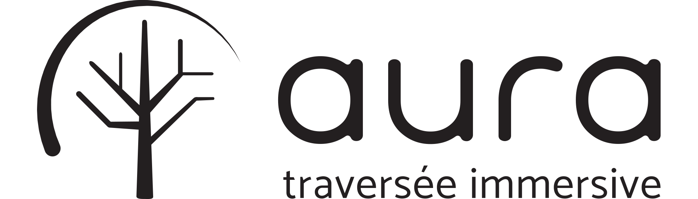

# 

### Méthodologie
- La branche `master` contient une version stable du projet
- La branche `develop` contient la version de développement du projet.
Lors de votre travail, utilisez la branche `develop`.  
Pour chaque sprint, un "pull request" sera ouvert, puis mergé à la fin du sprint dans la branche master. Aussi, un tag sera ajouté au commit lors du merge.

### Cloner le projet
```
git clone git@github.com:MIUQAM/aura.git
cd aura
git checkout develop
```

### Télécharger les ressources
- Visuel :
  - Télécharger l'archive suivante : http://projetaura.com/media/touchdesigner-media.zip
  - Extraire le contenu de l'archive dans le dossier `touchdesigner/media/`
- Audio :
  - Télécharger l'archive suivante : http://projetaura.com/media/max-media.zip
  - Extraire le contenu de l'archive dans le dossier `max/media/`


### Schéma de communication visuel


### Schéma de connexions

(cliquer pour élargir)