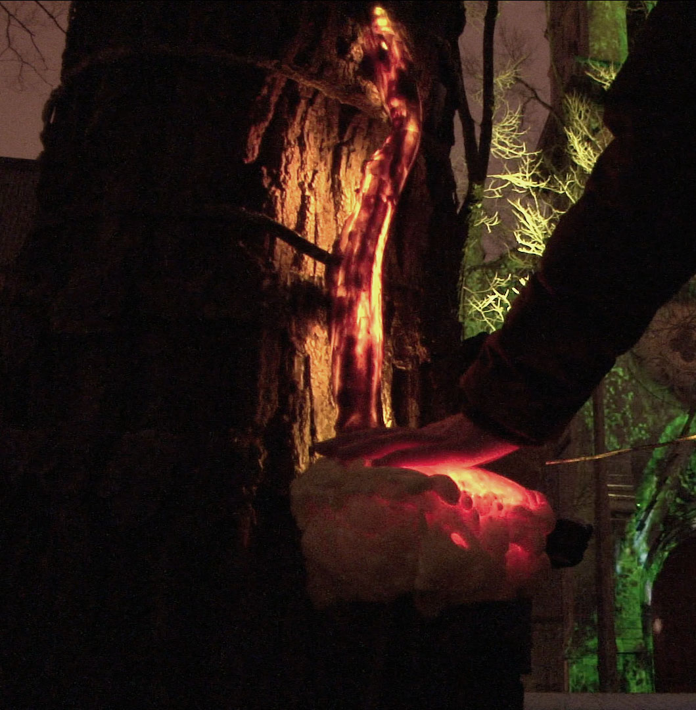
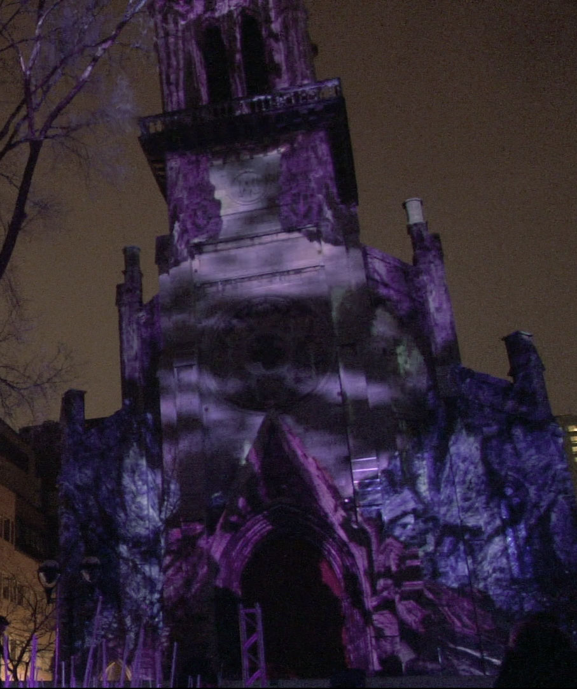
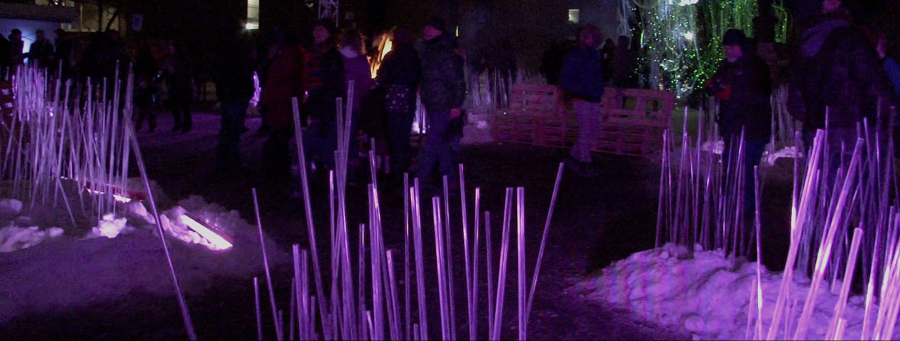
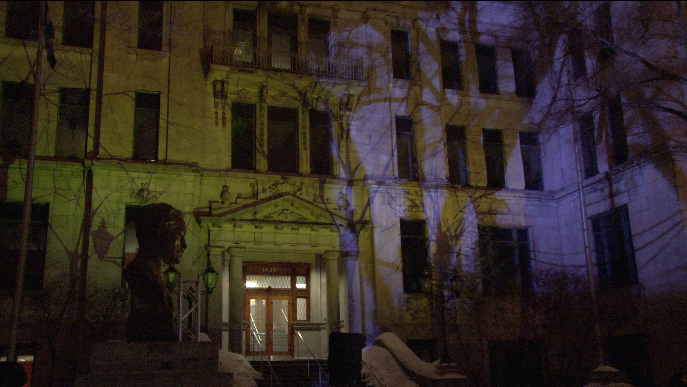
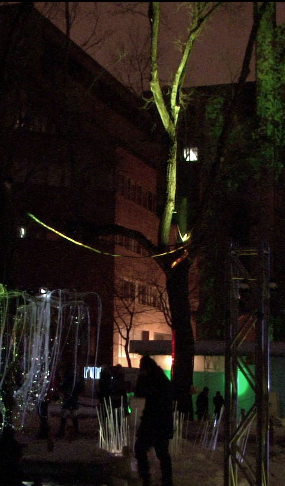
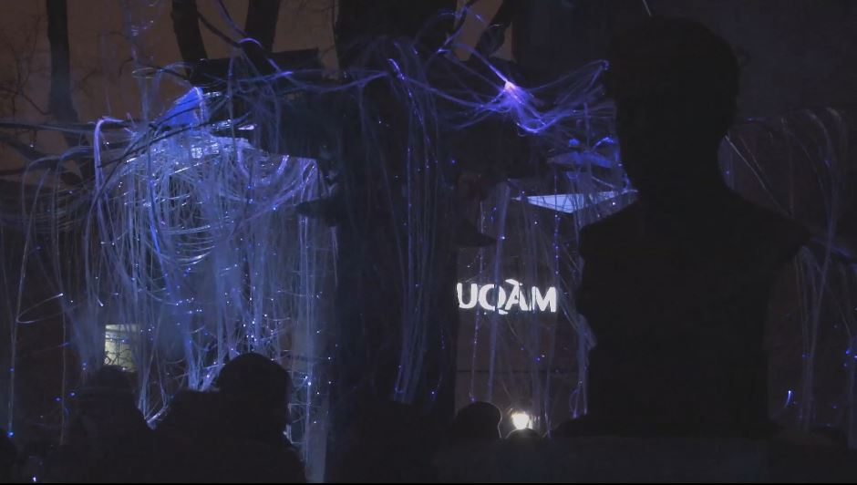

This is the visual part of Aura.  
Here are the different visual components of the project :

### Champignon & Veine / Mushroom & Vein
LEDs  

### Clocher / Tower
3x projectors  

### Étang / Pond
[ColorRails](http://www.chauvetdj.com/products/colorrail-irc/)  

### Rectorat / Rectorship
1x projector  

### Plafond & Canopée / Ceiling & Canopy
LEDs and [SlimPars](http://www.chauvetdj.com/products/slimpar-pro-rgba/)  

### Saule / Willow
Optical fiber & Optical fiber projector  
